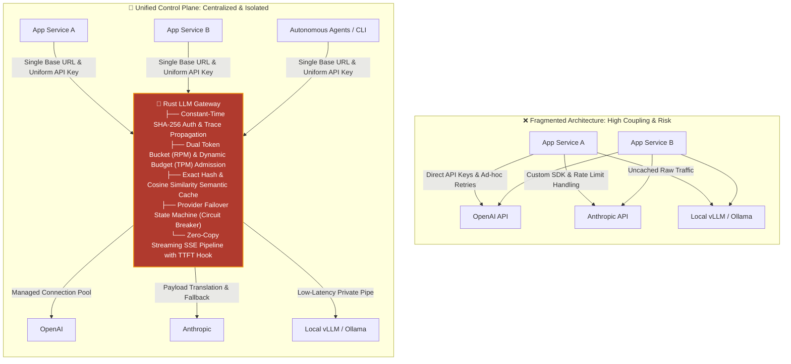
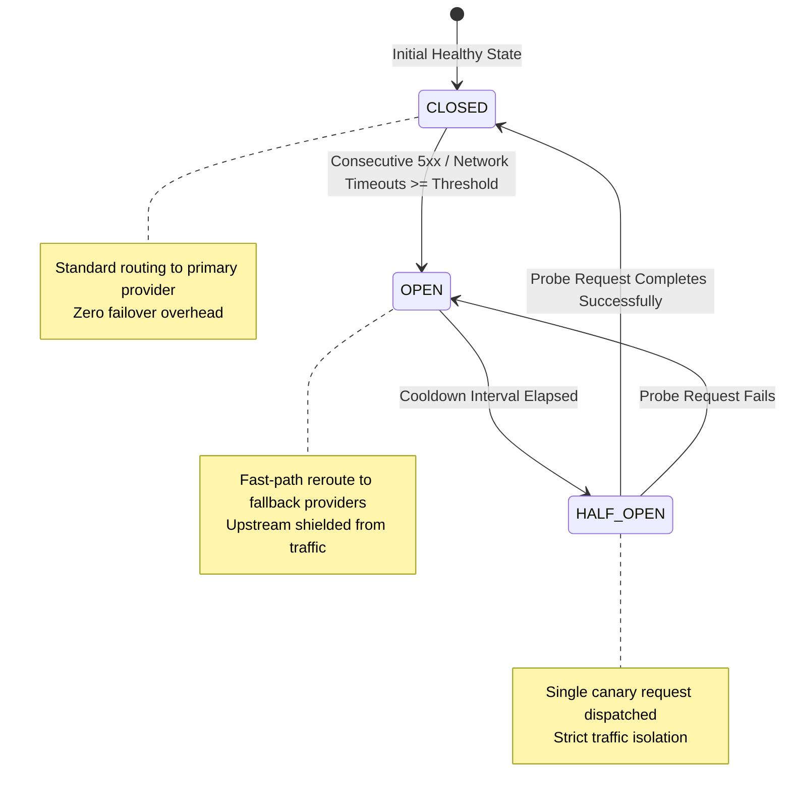
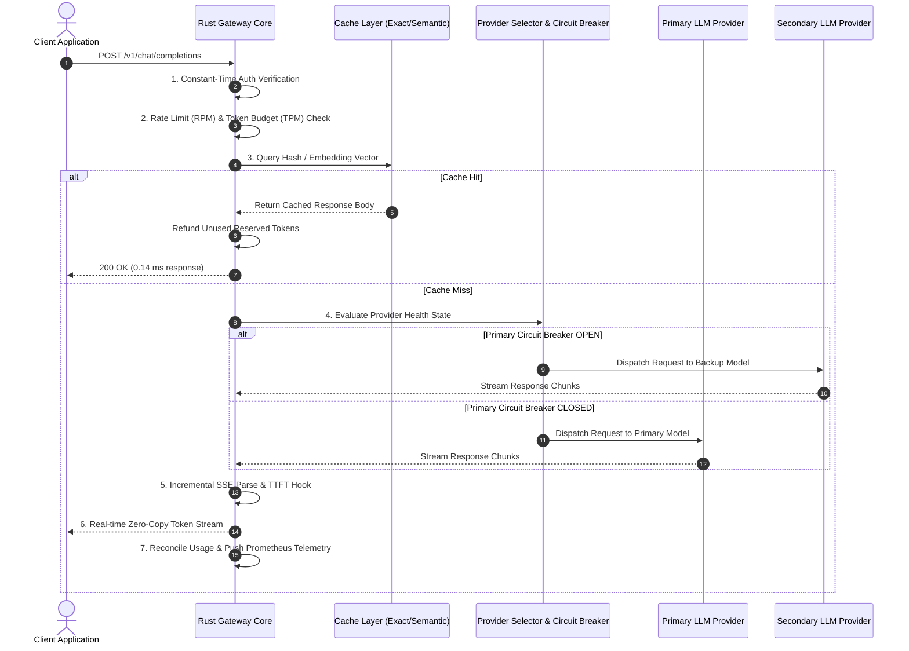
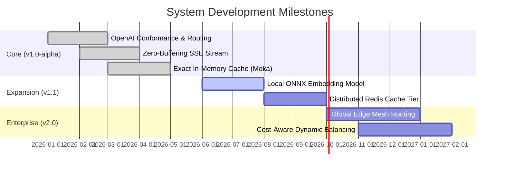

# Rust LLM Gateway & Semantic Router

```
  ____ _   _ ____ _____   _     _     __  __    ____    _  _____ ______        __  _ __   __
 |  _ \ | | / ___|_   _| | |   | |   |  \/  |  / ___|  / \|_   _| ____\ \      / / / \\ \ / /
 | |_) | | | \___ \ | |   | |   | |   | |\/| | | |  _  / _ \ | | |  _|  \ \ /\ / / / _ \\ V / 
 |  _ <| |_| |___) || |   | |___| |___| |  | | | |_| |/ ___ \| | | |___  \ V  V / / ___ \| |  
 |_| \_\\___/|____/ |_|   |_____|_____|_|  |_|  \____/_/   \_\_| |_____|  \_/\_/ /_/   \_\_|  

```

**An enterprise-grade, high-concurrency LLM routing plane and semantic cache engine built in Rust to decouple generative AI applications from upstream model providers.**

---

## Executive Summary & Engineering Motivation

Production generative AI architectures face three fundamental engineering bottlenecks:

1. **Vendor Lock-in & Interface Fragmentation:** Provider SDKs (OpenAI, Anthropic, Mistral, self-hosted vLLM/Ollama) force applications to maintain bespoke client layers, retry mechanisms, and authentication policies.
2. **Unbounded Cost & Latency Volatility:** LLM inferences are computationally expensive and non-deterministic in response duration. Repeated queries waste upstream token budgets without transparent caching.
3. **Cascading Failure & Rate-Limit Starvation:** Upstream 429s, API outages, and fluctuating rate limits directly degrade downstream user experience without centralized circuit breaking or dynamic failover.

**Rust LLM Gateway** sits as a zero-overhead reverse proxy between your application fleet and upstream AI providers, centralizing security, admission control, response caching, stream inspection, and multi-provider failover behind a unified, standard OpenAI-compatible API.

---

## The Architectural Shift



---

## Deep-Dive: Core Subsystems & Technical Mechanics

### 1. Dual-Tier Rate Limiting & Token Admission Control

Standard API gateways limit solely by Requests-Per-Minute (RPM). LLMs, however, are bound by **Tokens-Per-Minute (TPM)** quotas.

* **Pre-Execution Reservation:** Prior to upstream dispatch, the gateway estimates the prompt and completion footprint, reserving capacity against a concurrent in-memory token bucket.
* **Post-Execution Reconciliation:** If a request terminates early, hits cache, or generates fewer tokens than estimated, the unused allocation is instantly credited back to the budget in constant time ($O(1)$).
* **Backpressure Guarantee:** Upstream providers are shielded from burst saturation; clients receive deterministic `429 Too Many Requests` responses with explicit `Retry-After` headers before consuming network hops.

### 2. Dual-Layer Caching Engine

```
Incoming Payload
      │
      ├── [Temp == 0] ──► SHA-256 Hash Key ──► Moka Exact Cache (Hit: 0.14 ms)
      │
      └── [Temp > 0]  ──► Vector Embedding ──► Cosine Similarity Match (> Threshold)

```

* **Exact Cache:** Operates on deterministic inferences ($temperature = 0$) using canonical payload hashing with bounded, lock-free memory management via Moka.
* **Semantic Similarity Engine:** Normalizes prompt structures and performs cosine similarity vector comparisons against cached embeddings to eliminate redundant upstream inferences on semantically identical prompts.

### 3. Non-Buffering SSE Stream Pipeline & TTFT Tracking

Traditional proxies buffer entire responses in memory, delaying token delivery and spiking memory footprints.

* **Byte-Level Chunk Processing:** Streams incoming HTTP chunks directly through a sliding-window SSE parser without waiting for newline frame alignment.
* **True TTFT Extraction:** Time-to-First-Token is measured strictly when the first model payload chunk arrives—differentiating model inference lag from connection negotiation latency.
* **1 MiB Hard Buffer Ceiling:** Guards the gateway against malicious or malformed streaming payloads while maintaining low memory pressure.

### 4. Resilient Provider Routing & Circuit Breaking



---

## Performance Profile & Production Benchmarks

All metrics were gathered using optimized release builds (`opt-level = 3`, LTO enabled, single codegen unit, panic abort, symbol stripping).

```
SYSTEM OVERHEAD (Target: ≤ 5.00 ms)
[▓] 0.22 ms p95 (95.6% below maximum latency SLA)

MEMORY FOOTPRINT (Idle Target: < 50 MB)
[▓▓] 5.48 MB (89.0% below target ceiling)

CACHE ACCESS LATENCY
[▓] 0.14 ms p50 Exact Retrieval

```

### Concurrency Stress Test Analysis

```
Concurrency  Requests   Throughput    Latency (p50)   Latency (p95)   Working Set (RSS)
───────────────────────────────────────────────────────────────────────────────────────
100          200        4,039 RPS      18.93 ms        33.13 ms        19.52 MB
500        1,000        5,375 RPS      72.85 ms       117.54 ms        46.24 MB
1,000      2,000        4,231 RPS     198.52 ms       290.69 ms       115.80 MB

```

> **Verification Note:** 1,000 concurrent client connections execute with 100% request success. Higher localhost burst limits (5K–10K) were bounded by Windows OS ephemeral socket exhaustion (`WSAEADDRINUSE`) during instant barrier releases, while the gateway runtime process remained fully stable without crashes or memory corruption.

---

## Complete Request Lifecycle



---

## Architectural Principles

1. **Zero-Allocation Hot Path:** Minimized heap allocations during request transformation, path routing, and JSON validation.
2. **Fail-Fast Boundary:** Immediate rejection of unauthorized API keys (401), exhausted budgets (429), or oversized bodies (413) before invoking runtime async dispatchers.
3. **Total Failure Isolation:** Downstream clients are shielded from provider outages. Provider state machines dynamically adapt without requiring manual gateway restarts.
4. **Observable by Design:** Every request emits structured traces, Prometheus counters, histogram buckets (TTFT, latency), and error classifications with bounded label cardinality.

---

## Verification & Test Suite

```
Test Execution Matrix
========================================================================
[PASS] tests::auth::test_constant_time_comparison        ............ OK
[PASS] tests::rate_limit::test_rpm_sliding_window        ............ OK
[PASS] tests::rate_limit::test_tpm_reservation_refund    ............ OK
[PASS] tests::cache::test_exact_moka_lru_eviction        ............ OK
[PASS] tests::cache::test_semantic_cosine_similarity     ............ OK
[PASS] tests::stream::test_sse_chunk_boundary_splitting  ............ OK
[PASS] tests::router::test_circuit_breaker_state_machine ............ OK
[PASS] tests::proxy::test_openai_conformance             ............ OK
------------------------------------------------------------------------
Verification Summary: 36/36 Unit & Integration Tests PASS (100% Rate)
Static Analysis: `cargo clippy --all-targets -- -D warnings` (Clean)
Style Enforcement: `cargo fmt --check` (Clean)

```

---

## Project Structure

```
rust-llm-gateway/
├── config/              # Centralized TOML configurations (providers, rate limits)
├── src/
│   ├── handlers/        # Chat completions, embeddings, and health endpoints
│   ├── middleware/      # Constant-time auth, token admission, trace correlation
│   ├── router/          # Dynamic model selector & circuit breaker state machines
│   ├── cache/           # Moka exact hash cache & semantic similarity engine
│   ├── proxy/           # Non-buffering SSE chunk parser & HTTP transport
│   └── telemetry/       # Prometheus metrics exporter & OpenTelemetry hooks
├── tests/               # Conformance, failure injection, and load test suites
└── Dockerfile           # Minimal multi-stage scratch/distroless build

```

---

## Quickstart

### 1. Build and Run via Cargo

```bash
# Clone the repository
git clone https://github.com/your-username/rust-llm-gateway.git
cd rust-llm-gateway

# Run locally in release mode
cargo run --release

```

### 2. Run via Docker

```bash
docker build -t rust-llm-gateway .
docker run -p 8080:8080 -v $(pwd)/config:/config rust-llm-gateway

```

### 3. Verify Health & Route Completion

```bash
# Health Check
curl http://localhost:8080/healthz

# Proxy Chat Completion
curl http://localhost:8080/v1/chat/completions \
  -H "Authorization: Bearer YOUR_API_KEY" \
  -H "Content-Type: application/json" \
  -d '{
    "model": "gpt-4o-mini",
    "messages": [
      {"role": "user", "content": "Explain async runtimes in Rust."}
    ],
    "temperature": 0
  }'

```

---

## Roadmap



---

## Author & Maintainer

**Ruchir Huchgol**

AI Infrastructure | High-Performance Systems | Rust Backend Engineering

---

## License

This project is open-source software licensed under the [MIT License](https://www.google.com/search?q=LICENSE).
